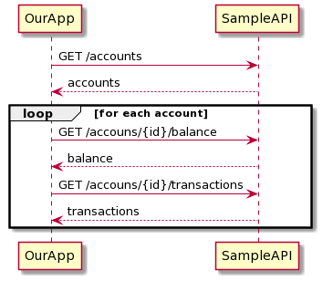

# Microservices collaboration
We have our simple Rest API exposing invoices from `lab 1`


In this lab, we need to connect to a PSD2 service to get user accounts and transactions.
Based on the transaction name we need to detect paid invoices.




## CompletableFuture challenges
Before we start, we need to become familiarized with the `CompletableFuture` methods.

Fix all the `CompletableFutureTests` failing tests.

```java
import org.junit.jupiter.api.Test;
import org.slf4j.Logger;
import org.slf4j.LoggerFactory;

import java.util.List;
import java.util.concurrent.*;
import java.util.concurrent.atomic.AtomicBoolean;
import java.util.function.Supplier;
import java.util.stream.Collectors;
import java.util.stream.IntStream;

import static java.util.Arrays.asList;
import static org.junit.jupiter.api.Assertions.assertEquals;
import static org.junit.jupiter.api.Assertions.assertTrue;

public class CompletableFutureTests {
    private static final Logger log = LoggerFactory.getLogger(CompletableFutureTests.class);

    @Test
    public void test1() {

        AtomicBoolean called = new AtomicBoolean();
        CompletableFuture<Void> future = CompletableFuture.runAsync(new Runnable() {
            @Override
            public void run() {
                try {
                    TimeUnit.SECONDS.sleep(1);
                } catch (InterruptedException e) {
                    throw new IllegalStateException(e);
                }
                log.debug("hello");
                called.set(true);
            }
        });

        //FIXME should be true
        assertTrue(called.get());
    }

    @Test
    public void test2() {

        AtomicBoolean called = new AtomicBoolean();
        CompletableFuture<String> future = CompletableFuture.supplyAsync(new Supplier<String>() {
            @Override
            public String get() {
                try {
                    TimeUnit.SECONDS.sleep(1);
                } catch (InterruptedException e) {
                    throw new IllegalStateException(e);
                }
                log.debug("hello");
                called.set(true);
                return "something";

            }
        });

        //FIXME should be true
        assertTrue(called.get());
    }

    @Test
    public void test3() throws ExecutionException, InterruptedException {

        CompletableFuture<String> future = CompletableFuture.supplyAsync(() -> "something");

        //FIXME check what methods from the future object can be called so the test passes.
        assertEquals("something else", future.get());
    }

    @Test
    public void test4() throws InterruptedException {

        CountDownLatch latch = new CountDownLatch(1);
        CompletableFuture<String> future = CompletableFuture.supplyAsync(() -> {
            log.debug("start");
            return "start";
        });

        latch.await(1, TimeUnit.SECONDS);
        //FIXME on the future, after the first completionStage call a method to invoke latch.countDown();.
        // What difference is between thenAccept and thenRun?
        assertEquals(0, latch.getCount());
    }

    @Test
    public void test5() throws ExecutionException, InterruptedException {

        Executor executor = Executors.newFixedThreadPool(1);
        CompletableFuture<String> res = CompletableFuture.supplyAsync(() -> {
            return "start";
        }).thenApply(result -> {
            // FIXME can we run this code in another thread?
            return Thread.currentThread().getName();
        });

        assertTrue(res.get().startsWith("pool-1-thread"));
    }

    CountDownLatch latch = new CountDownLatch(2);

    CompletableFuture<String> getA(String input) {
        return CompletableFuture.supplyAsync(() -> {
            latch.countDown();
            return "a-" + input;
        });
    }

    CompletableFuture<Integer> getB(String a) {
        return CompletableFuture.supplyAsync(() -> {
            latch.countDown();
            return a.length();
        });
    }

    @Test
    public void test6() throws ExecutionException, InterruptedException {

        CompletableFuture<String> future = getA("start");

        // FIXME both getA("start") and getB("start") needs to be called at the same time
        // hint: use thenCombine

        latch.await(1, TimeUnit.SECONDS);
        assertEquals(0, latch.getCount());
        assertEquals("a-start-5", future.get());
    }

    @Test
    public void test7() throws InterruptedException {

        int COUNTER = 10;
        CountDownLatch latch = new CountDownLatch(COUNTER);
        List<CompletableFuture<Integer>> completableFutureStream = IntStream.range(0, COUNTER)
                .mapToObj(i -> CompletableFuture.supplyAsync(() -> {
                    try {
                        Thread.sleep(1000);
                    } catch (InterruptedException e) {
                        throw new RuntimeException(e);
                    }
                    latch.countDown();
                    return i;
                }))
                .collect(Collectors.toList());

        // FIXME wait for all completable futures to finish and sum all the results
        // hint: use allOf

        latch.await(1, TimeUnit.SECONDS);
        assertEquals(0, latch.getCount());
    }

    @Test
    public void test8() {

        CompletableFuture<Integer> a = CompletableFuture.supplyAsync(() -> {
            log.info("a");
            try {
                Thread.sleep(1000);
            } catch (InterruptedException e) {
                throw new RuntimeException(e);
            }
            return 1;
        });
        CompletableFuture<Integer> b = CompletableFuture.supplyAsync(() -> {
            log.info("b");
            try {
                Thread.sleep(1000);
            } catch (InterruptedException e) {
                throw new RuntimeException(e);
            }
            return 2;
        });

        // FIXME wait for any of the completable futures to finish
        // hint: use anyOf

        Object any = null;
        assertTrue(asList(1, 2).contains(any));
    }

    @Test
    public void test9() throws ExecutionException, InterruptedException {

        CompletableFuture.supplyAsync(() -> {
                    log.info("supplyAsync");
                    throw new IllegalStateException("ooops");
                }).thenApply(result -> {
                    log.info("thenApply");
                    return "b";
                }).thenAccept(result -> {
                    log.info("thenAccept - result {}", result);
                })
                // FIXME handle the exception
                .get();
    }

}
```

## Calling another service

APIs are interfaces to business logic encapsulated inside a service.
With Rest API, we use Open API specifications:

```yaml
swagger: "2.0"
info:
  description: "Sample API"
  version: "1.0.0"
  title: "Swagger Sample API"
  license:
    name: "Apache 2.0"
    url: "http://www.apache.org/licenses/LICENSE-2.0.html"
host: "api.example.com"
basePath: "/v2"
tags:
- name: "account"
  description: "Everything about your Account"
- name: "transaction"
  description: "Access to transactions"
- name: "balance"
  description: "Access to balance"
schemes:
- "https"
- "http"
paths:
  /accounts:
    get:
      tags:
      - "account"
      summary: "Get all acccounts"
      description: ""
      operationId: "getAccount"
      consumes:
      - "application/json"
      produces:
      - "application/json"
      responses:
        "200":
          description: "List of accounts"
          schema:
            type: "array"
            items:
              $ref: "#/definitions/Account"
  /accounts/{id}/transactions:
    get:
      tags:
      - "transaction"
      summary: "Get all transactions"
      description: ""
      operationId: "getTransactions"
      parameters:
       - name: "id"
         in: "path"
         description: "The account id"
         required: true
         type: "string"
      consumes:
      - "application/json"
      produces:
      - "application/json"
      responses:
        "200":
          description: "List of transactions"
          schema:
            type: "array"
            items:
              $ref: "#/definitions/Transaction"
  /accounts/{id}/balance:
    get:
      tags:
      - "balance"
      summary: "Get balance"
      description: ""
      operationId: "getBalance"
      parameters:
       - name: "id"
         in: "path"
         description: "The account id"
         required: true
         type: "string"
      consumes:
      - "application/json"
      produces:
      - "application/json"
      responses:
        "200":
          description: "List of transactions"
          schema:
              $ref: "#/definitions/Balance"
definitions:
  Account:
    type: "object"
    required:
    - "name"
    - "id"
    properties:
      id:
        type: "string"
      name:
        type: "string"
  Transaction:
    type: "object"
    required:
    - "id"
    - "name"
    - "value"
    properties:
      id:
        type: "string"
      name:
        type: "string"
      value:
        type: "number"
  Balance:
    type: "object"
    required:
    - "currency"
    - "value"
    properties:
      currency:
        type: "string"
      value:
        type: "number"
```
Enable Spring Cloud
```xml
...
<spring-cloud.version>2022.0.0-RC2</spring-cloud.version>
...
`    <dependencyManagement>
        <dependencies>
            <dependency>
                <groupId>org.springframework.cloud</groupId>
                <artifactId>spring-cloud-dependencies</artifactId>
                <version>${spring-cloud.version}</version>
                <type>pom</type>
                <scope>import</scope>
            </dependency>
        </dependencies>
    </dependencyManagement>
```

Let's consume the endpoints described by this interface.

Add `spring-cloud-starter-contract-stub-runner`
```xml
        <dependency>
            <groupId>org.springframework.cloud</groupId>
            <artifactId>spring-cloud-starter-contract-stub-runner</artifactId>
            <scope>test</scope>
        </dependency>
```
Http clients: RestTemplate, WebClient, HttpClient, OkHttp, Finagle etc

Add `Finagle`

```xml
        <dependency>
            <groupId>com.twitter</groupId>
            <artifactId>finagle-core_2.13</artifactId>
            <version>20.4.0</version>
        </dependency>
        <dependency>
            <groupId>com.twitter</groupId>
            <artifactId>finagle-http_2.13</artifactId>
            <version>20.4.0</version>
        </dependency>
```

Configure Finagle to call the remote service:

```java
@Configuration
public class FinagleConfig {
    private static final Logger log = LoggerFactory.getLogger(FinagleConfig.class);

    @Bean
    public Service<Request, Response> httpClient(@Value("${wiremock.server.port:8080}") int port) {
        return Http.client().newService(":" + port);
    }
}
```

Deserialize everything into an `Account`:
```java
public record Account(String id, String name) {
}
```

Create a service `AccountService` to get the accounts
```java

@Component
public class AccountService {
    private static final Logger log = LoggerFactory.getLogger(AccountService.class);
    private final Service<Request, Response> httpClient;
    private final ObjectMapper mapper;

    public AccountService(Service<Request, Response> httpClient, ObjectMapper mapper) {
        this.httpClient = httpClient;
        this.mapper = mapper;
    }

    public CompletableFuture<List<Account>> getAccounts() {

        Request request = Request.apply(Method.Get(), "/v2/accounts");
        request.host("localhost");
        Future<Response> response = httpClient.apply(request);

        return response.toCompletableFuture()
                .thenCompose(r -> {
                    Response res = (Response) r;
                    log.debug("getAccounts - received: {}, body: {}", res, res.contentString());
                    if (res.status() != Status.Ok()) {
                        return CompletableFuture.failedFuture(new IllegalStateException("could not get account"));
                    }
                    try {
                        List<Account> accounts = mapper.readValue(res.contentString(), new TypeReference<>() {});
                        return CompletableFuture.completedFuture(accounts);
                    } catch (JsonProcessingException e) {
                        log.error("getAccounts - error deserializing response", e);
                        return CompletableFuture.failedFuture(e);
                    }
                });
    }
}
```

Add mocks to `src/main/resources/mappings/accounts.json`
```json
{
  "request": {
    "method": "GET",
    "url": "/v2/accounts"
  },
  "response": {
    "status": 200,
    "headers": {
      "Content-Type": "application/json",
      "Cache-Control": "no-cache"
    },
    "fixedDelayMilliseconds": 500,
    "bodyFileName": "accounts.json"
  }
}
```
Add to `src/main/resources/__files/accounts.json`
```json
[
  {
    "id": "123",
    "name": "Account name 12312312"
  }
]
```
In a similar way, to the same for `Balance`:
```json
{
  "request": {
    "method": "GET",
    "url": "/v2/accounts/123/balance"
  },
  "response": {
    "status": 200,
    "delayDistribution": {
      "type": "lognormal",
      "median": 1000,
      "sigma": 0.4
    },
    "headers": {
      "Content-Type": "application/json",
      "Cache-Control": "no-cache"
    },
    "bodyFileName": "balance.json"
  }
}

```
With content `balance.json`:
```json
{
  "currency": "EUR",
  "value": 99.99
}

```

And the same for transactions:
```json
[
  {
    "id": "id-12345",
    "name": "Transaction 123r5432",
    "value": 5.99
  },
  {
    "id": "id-565556",
    "name": "Transaction name 12312312",
    "value": 11.10
  },
  {
    "id": "id-43543534",
    "name": "Transaction name 12312312",
    "value": 23.99
  }
]

```

Write the first test:

```java
@SpringBootTest(webEnvironment = SpringBootTest.WebEnvironment.DEFINED_PORT)
@AutoConfigureMockMvc
@AutoConfigureWireMock(port = 0)
class AccountServiceTest {

    @Autowired
    AccountService service;

    @Test
    public void test() throws ExecutionException, InterruptedException {
        assertNotNull(service.getAccounts()
                .get());

    }

}
```

Create an endpoint to return an account with balance and transactions.

```java
@RestController
public class MyController {

    @GetMapping("/api/accounts/details")
    public AccountWithTransactions getAccountsDetails() throws ExecutionException, InterruptedException {
        log.debug("getAccountsDetails - start http");
        return null; // TODO call to get all data
    }
}
```

```java
@Test
public void testAccountsDetails() throws Exception {

        log.debug("CPU Core: " + Runtime.getRuntime().availableProcessors());
        log.debug("CommonPool Parallelism: " + ForkJoinPool.commonPool().getParallelism());
        log.debug("CommonPool Common Parallelism: " + ForkJoinPool.getCommonPoolParallelism());
        int count = 100;
        CountDownLatch latch = new CountDownLatch(1);
        ExecutorService executor = Executors.newFixedThreadPool(10);
        List<CompletableFuture<Void>> cfs = IntStream.range(0, count)
                .mapToObj(i ->
                        CompletableFuture.runAsync(() ->
                        {
                            try {

                                this.mockMvc.perform(get("/api/accounts/details"))
                                        .andDo(print())
                                        .andExpect(status().isOk())
                                        .andExpect(jsonPath("$.length()").value(1));
                            } catch (Exception e) {
                                throw new IllegalStateException(e);
                            }
                        }, executor))
                .collect(Collectors.toList());

        AtomicBoolean hasErrors = new AtomicBoolean();
        CompletableFuture.allOf(cfs.toArray(new CompletableFuture[]{}))
                .handle((v, err) -> {
                    hasErrors.set(err != null);
                    log.debug("testAccountsDetails - finish with: " + err);
                    latch.countDown();
                    return null;
                });
        latch.await();
        Assertions.assertFalse(hasErrors.get());
}
```
There are many problems that can appear when calling a remote service: it may be unreachable, busy, dead etc. Fortunately Finagle supports many features to create a resilient connection.

[Retry](https://twitter.github.io/finagle/guide/Clients.html#retries) — add a retry filter to handle situations when a new call might help. Be careful not to create a retry storm.
Timeouts — you don’t want to block your resources for an unlimited amount of time
Circuit Breakers — if a remote service is down, you can allow it to recover by not sending more requests to it. At the same time, you still need to attempt a new connection at some point.
Load Balancing — with Service Discovery in place, usually an API exposes multiple instances that can handle our requests. Finagle supports client side-load balancing to decide what instance to call.
The rest of the list [here](https://twitter.github.io/finagle/guide/Clients.html#clients).

```java
@Configuration
public class FinagleConfig {
    private static final Logger log = LoggerFactory.getLogger(FinagleConfig.class);


    @Bean
    public Service<Request, Response> httpClient(@Value("${wiremock.server.port:8080}") int port,
                                                 @Value("${global-timeout:5000}") int globalTimeout,
                                                 @Value("${request-timeout:1000}") int requestTimeout) {

        Duration timeoutDuration = Duration.fromMilliseconds(globalTimeout);
        final TimeoutFilter<Request, Response> timeoutFilter = new TimeoutFilter<>(
                timeoutDuration,
                new GlobalRequestTimeoutException(timeoutDuration),
                DefaultTimer.getInstance()
        );

        Stream<Duration> backoff = Backoff.exponentialJittered(Duration.fromMilliseconds(100), Duration.fromMilliseconds(30_000));
        RetryExceptionsFilter<Request, Response> rt = new RetryExceptionsFilter<>(
                RetryPolicy.backoffJava(Backoff
                                .toJava(backoff),
                        RetryPolicy.TimeoutAndWriteExceptionsOnly()), HighResTimer.Default(), NullStatsReceiver.get());

        RetryBudget budget = RetryBudgets.newRetryBudget(Duration.fromMilliseconds(1000), 10, 1);
        Http.Client client = Http.client()
                .withRetryBudget(budget)
                .withRetryBackoff(backoff)
                .withRequestTimeout(Duration.fromMilliseconds(requestTimeout));

        return new LogFilter()
                .andThen(timeoutFilter)
                .andThen(rt)
                .andThen(client.newService(":" + port));

    }
}
```


```java
import com.twitter.finagle.Service;
import com.twitter.finagle.SimpleFilter;
import com.twitter.finagle.http.Request;
import com.twitter.finagle.http.Response;
import com.twitter.util.Future;
import org.slf4j.Logger;
import org.slf4j.LoggerFactory;

public class LogFilter extends SimpleFilter<Request, Response> {
    private static final Logger log = LoggerFactory.getLogger(LogFilter.class);

    @Override
    public Future apply(Request request, Service<Request, Response> service) {
        log.debug("Request:" + request);
        return service.apply(request);
    }
}
```

Wiremock customizer

```java
@Configuration
public class WiremockConfig {
    private static final Logger log = LoggerFactory.getLogger(WiremockConfig.class);

    @Bean
    WireMockConfigurationCustomizer optionsCustomizer() {
        return options -> {
            options.asynchronousResponseEnabled(true);
            options.asynchronousResponseThreads(100);
            options.jettyAcceptQueueSize(130_000);
            log.info("changing wiremock config: {}", options);
        };
    }
}
```
## Observability

```xml

        <dependency>
            <groupId>org.springframework.boot</groupId>
            <artifactId>spring-boot-starter-actuator</artifactId>
            <scope>test</scope>
        </dependency>
        <dependency>
            <groupId>de.codecentric</groupId>
            <artifactId>spring-boot-admin-starter-server</artifactId>
            <version>2.4.0</version>
        </dependency>
        <dependency>
            <groupId>de.codecentric</groupId>
            <artifactId>spring-boot-admin-starter-client</artifactId>
            <version>2.4.0</version>
        </dependency>
```

Add
```java
@EnableAdminServer
```

```java
@SpringBootTest(properties = {
        "management.endpoints.web.exposure.include=*",
        "spring.boot.admin.client.url=http://localhost:8080"
}, webEnvironment = SpringBootTest.WebEnvironment.DEFINED_PORT)
```


```java

return accountService.getAccounts()
                .thenCompose(accounts -> {
                    List<CompletableFuture<AccountWithTransactions.Accounts>> details = accounts.stream()
                            .map(a -> transactionService.getTransactions(a.getId())
                                    .thenCombine(balanceService.getBalance(a.getId()), (transactions, balance)-> {
                                        AccountWithTransactions.Accounts newAccount = new AccountWithTransactions.Accounts();
                                        newAccount.setAccount(a);
                                        newAccount.setTransactions(transactions);
                                        newAccount.setBalance(balance);
                                        return newAccount;
                                    }))
                            .collect(Collectors.toList());
                    return CompletableFuture.allOf(details.toArray(new CompletableFuture[]{}))
                            .thenApply(v -> {
                                List<AccountWithTransactions.Accounts> accountsList = details.stream()
                                        .map(CompletableFuture::join)
                                        .collect(Collectors.toList());
                                AccountWithTransactions a = new AccountWithTransactions();
                                a.setAccounts(accountsList);
                                return a;
                            });
                });
```

